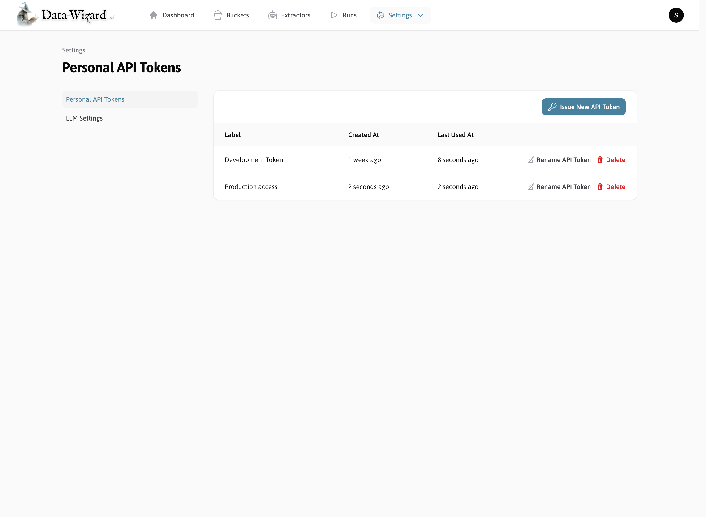
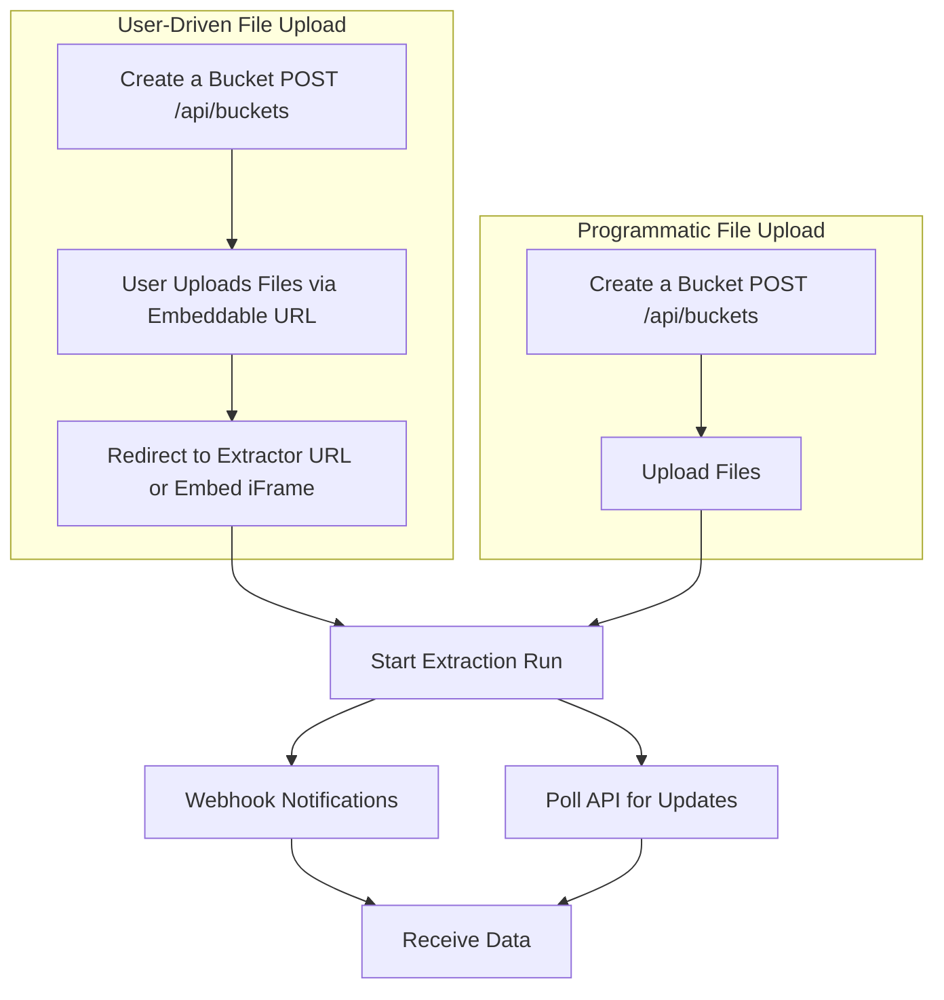

For more advanced integration scenarios or applications requiring deeper control over the data extraction process, Data Wizard provides both **HTTP REST API** and **GraphQL API** endpoints. These APIs allow you to interact with Data Wizard programmatically, without relying on the embedded iFrame UI.

## Authentication

To authenticate, provide a valid Bearer token in the `Authorization` header of your requests. You can generate API tokens in the Data Wizard backend under "Settings" > "Personal Access Tokens".

<Steps>
    <Step title="Generate a Personal Access Token">
        Log in to your Data Wizard backend and navigate to the "Personal API Tokens" page under "Settings". Generate a new API token and save it securely.

        
    </Step>
    <Step title="Include Bearer Token in HTTP Requests">
        When making API requests, include your API token in the `Authorization` header as a Bearer token:

        ```
        Authorization: Bearer YOUR_API_TOKEN
        ```
    </Step>
    <Step title="Explore the API">
        Use the [interactive API documentation](./api-reference) to explore available endpoints and test requests directly in your browser.

        <Card title="Interactive API Documentation" icon="play" href="./api-reference">
            Explore the API endpoints and test requests directly in the interactive API documentation.
        </Card>

        <Card title="API Reference" icon="book" href="./api-reference">
            Read the full HTTP API reference for Data Wizard, including available endpoints and request/response schemas.
        <br/>

        **Buckets:**
        - `POST /api/buckets`: Create a new Extraction Bucket.
        - `GET /api/buckets`: List all Extraction Buckets.
        - `GET /api/buckets/{id}`: Retrieve a specific Extraction Bucket.
        - `DELETE /api/buckets/{id}`: Delete an Extraction Bucket.

        <br/>

        **Extractors:**
        - `POST /api/saved_extractors`: Create a new Extractor (SavedExtractor).
        - `GET /api/saved_extractors`: List all Extractors.
        - `GET /api/saved_extractors/{id}`: Retrieve a specific Extractor.
        - `PUT /api/saved_extractors/{id}`: Update an Extractor.
        - `DELETE /api/saved_extractors/{id}`: Delete an Extractor.

        <br/>

        **Extraction Runs:**
        - `POST /api/extraction_runs`: Start a new Extraction Run.
        - `GET /api/extraction_runs`: List all Extraction Runs.
        - `GET /api/extraction_runs/{id}`: Retrieve a specific Extraction Run.
        - `GET /api/extraction_runs/{id}/results`: Retrieve results of an Extraction Run.
        </Card>

    </Step>
</Steps>


## Endpoints

### REST API

The primary way to interact with Data Wizard programmatically is through the REST API. The REST API provides endpoints for managing Extraction Buckets, Extractors, and Extraction Runs.

<Card title="Read the HTTP API Reference" icon="book" href="./api-reference">
<br/>

**Buckets:**
- `POST /api/buckets`: Create a new Extraction Bucket.
- `GET /api/buckets`: List all Extraction Buckets.
- `GET /api/buckets/{id}`: Retrieve a specific Extraction Bucket.
- `DELETE /api/buckets/{id}`: Delete an Extraction Bucket.

<br/>

**Extractors:**
- `POST /api/saved_extractors`: Create a new Extractor (SavedExtractor).
- `GET /api/saved_extractors`: List all Extractors.
- `GET /api/saved_extractors/{id}`: Retrieve a specific Extractor.
- `PUT /api/saved_extractors/{id}`: Update an Extractor.
- `DELETE /api/saved_extractors/{id}`: Delete an Extractor.

<br/>

**Extraction Runs:**
- `POST /api/extraction_runs`: Start a new Extraction Run.
- `GET /api/extraction_runs`: List all Extraction Runs.
- `GET /api/extraction_runs/{id}`: Retrieve a specific Extraction Run.
- `GET /api/extraction_runs/{id}/results`: Retrieve results of an Extraction Run.
</Card>

<Card title="Try the API in the playground" icon="play" href="./api-reference">
Explore the API endpoints and test requests directly in the interactive API documentation.
</Card>

### GraphQL API

Data Wizard also exposes a GraphQL endpoint for more flexible data querying. This is automatically generated using [API Platform](https://api-platform.com/), which provides a powerful and extensible GraphQL API based on the REST API.

<Warning>
    This API is provided as a helpful alternative to the REST API, but is not actively maintained beyond the switch being enabled in [API Platform](https://api-platform.com/).
</Warning>


*   **GraphQL Endpoint URL:** `https://YOUR_DATA_WIZARD_URL/api/graphql`

*   **GraphQL Queries:**  GraphQL allows you to specify exactly the data you need in your queries, reducing over-fetching and improving efficiency.

**Example GraphQL Query:**

```graphql
query {
  savedExtractors {
    collection {
      id
      label
    }
  }
}
```

## Programmatic Data Extraction Workflow

Using the HTTP or GraphQL API, you can automate your data extraction workflow:



<Steps>
    <Step title="Create a Bucket">
        Create a new bucket and embed or redirect users to upload files using the embeddable URL of the bucket.
    </Step>
    <Step title="Redirect User to extractor URL or embed the iFrame">
        Redirect users to the extractor URL or embed the iFrame in your application to allow users to configure and run the extractor.

        The user will then be walked through the steps of uploading files and can edit and download the extracted data.
    </Step>
    <Step title="(Alternatively) Upload some files using the HTTP API and begin">
        Use the HTTP API to upload files directly to a bucket and start an Extraction Run programmatically.
    </Step>
    <Step title="Receive Webhooks for progress updates">
        You can configure webhooks in the extractor to receive progress updates and results of the Extraction Run.

        Alternatively, you can also regularly poll the API for updates.
    </Step>
    <Step title="Retrieve Results 🪄">
        Once the Extraction Run is complete, retrieve the extracted data in JSON, XML, or CSV format using the API.

        You will also be notified via webhook if you have configured one.
    </Step>
</Steps>


import More from '/snippets/more.mdx';

<More />