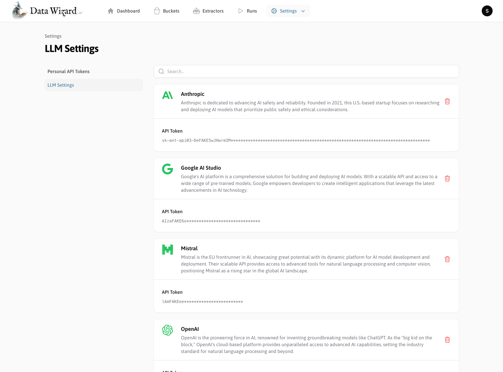
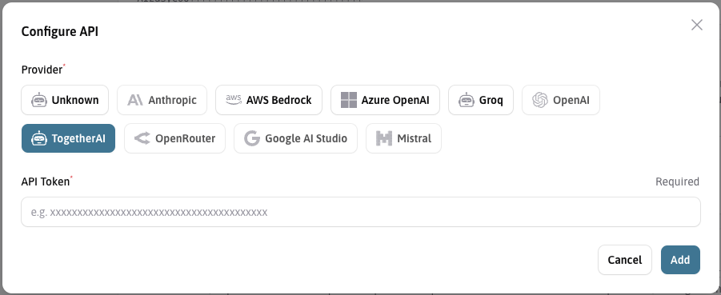

Data Wizard is designed to be LLM provider-agnostic, allowing you to choose from a variety of Large Language Models to power your data extraction tasks.
To use Data Wizard, you need to configure your preferred LLM API provider and provide the necessary API keys.

It relies on the power of the [LLM Magic](https://github.com/Capevace/llm-magic) PHP package to interact with almost any LLM provider, enabling you to switch between providers easily.

## Supported LLM Providers

Data Wizard currently supports integration with the following leading LLM providers:

*   **OpenAI:**  Access models like GPT-4, GPT-3.5 Turbo, and more.
*   **Anthropic:**  Utilize Claude 3 Opus, Claude 3 Sonnet, Claude 3 Haiku, and other Claude models.
*   **Google AI:**  Leverage Gemini models (Gemini Pro, Gemini Flash).
*   **Mistral AI:** Access Mistral Large, Mistral Small, Mistral 7B, and other Mistral models.
*   **OpenRouter:** A proxy service that provides access to various LLMs through a single API, including models from OpenAI, Anthropic, Google, Mistral, and open-source models.
*   **Ollama:**  For running and using open-source LLMs locally on your machine.

## Configuring API Keys

You need to obtain API keys from your chosen LLM provider and configure them in Data Wizard.

### 1.  **Obtain API Keys:**

    *   **OpenAI:**  Create an account at [OpenAI Platform](https://platform.openai.com/) and generate API keys in your account settings.
    *   **Anthropic:** Sign up for an Anthropic account and obtain your API key from the Anthropic Console.
    *   **Google AI (Gemini):**  Set up a Google Cloud project and enable the Gemini API. Generate API keys in the Google Cloud Console.
    *   **Mistral AI:** Create an account at [Mistral AI](https://mistral.ai/) and find your API key in your account dashboard.
    *   **OpenRouter:** Sign up at [OpenRouter](https://openrouter.ai/) and get your API key from your OpenRouter account.
    *   **Ollama:** Ollama is for local model serving. You don't need API keys, but you need to have Ollama installed and running with the desired models downloaded.

### 2.  **Configure API Keys in Data Wizard:**

    *   **Access Settings:** Log in to your Data Wizard backend as a superadmin and navigate to the "Settings" menu item.
    *   **LLM Provider Settings:** Find the section for "LLM Providers". You will see settings for each supported provider.
        
    *   **Enter API Keys:** For your chosen provider, enter your API key in the designated field (e.g., "OpenAI API Key").
        

## Configuration via Environment Variables (Docker):

When running Data Wizard in Docker, you can also configure API keys using environment variables. This is often a more secure and convenient way to manage secrets in containerized environments.

- **Example Docker Command with OpenAI API Key:**

    ```bash
    docker run \
      -p 9090:80 \
      -e OPENAI_API_TOKEN=<YOUR_OPENAI_API_KEY> \
      mateffy/data-wizard:latest
    ```

    Replace `<YOUR_OPENAI_API_KEY>` with your actual OpenAI API key. Environment variables for other providers would follow a similar pattern (e.g., `ANTHROPIC_API_KEY`, `GOOGLE_API_KEY`, `MISTRAL_API_KEY`, `OPENROUTER_API_KEY`).

- **Example Docker Compose File with OpenAI API Key**
    ```yaml
    services:
      data-wizard:
        image: mateffy/data-wizard:latest
        ports:
          - ...
        volumes:
          - ...
        environment:
          - APP_KEY=<REPLACE_WITH_APP_KEY>
          - OPENAI_API_TOKEN=<YOUR_OPEN_AI_API_KEY>

    ```

## Selecting an LLM in Extractors

Once you have configured your API keys, you can select specific LLMs within each Extractor.

1.  **Edit Extractor:** Open the Extractor you want to configure.
    
2.  **Select Model:** In the Extractor settings, find the "Model" dropdown menu.
3.  **Choose a Model:** Select your desired LLM from the list. The list is populated based on the providers you have configured and the models supported by Data Wizard.
    

### Model String Format

You can also use model strings in the format `<provider>/<model>` to specify models. For example:

*   `openai/gpt-4o`
*   `anthropic/claude-3.5-sonnet`
*   `google/gemini-2.0-flash-lite`
*   `mistral/mistral-large`

### Choosing the Right LLM

The choice of LLM impacts:

*   **Performance:** Different models have varying strengths in different tasks (e.g., reasoning, code generation, text generation). Refer to benchmark data and provider documentation to understand model capabilities.
*   **Context Length:** Models have different context window sizes, limiting the amount of text and images they can process per inference call.
*   **Cost:** Pricing varies significantly between models and providers. Consider the cost per token for input and output tokens, especially for large-scale data extraction.

Refer to up-to-date benchmarks like [Livebench](https://livebench.ai) for current performance metrics across different model families.

Consider these factors when selecting an LLM for your specific extraction tasks and budget. Data Wizard's evaluation features can help you compare the performance of different models.


import More from '/snippets/more.mdx';

<More />