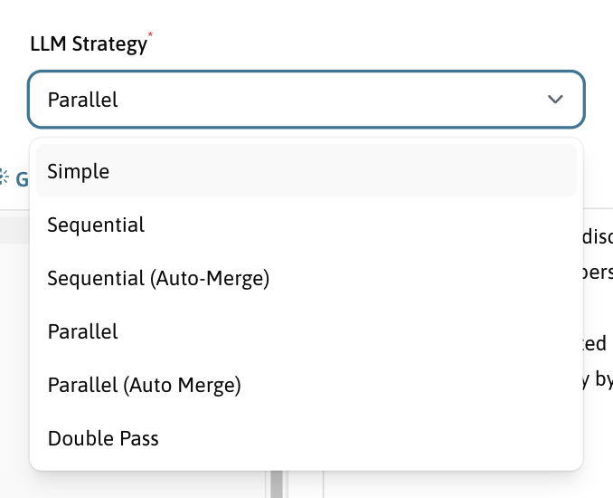
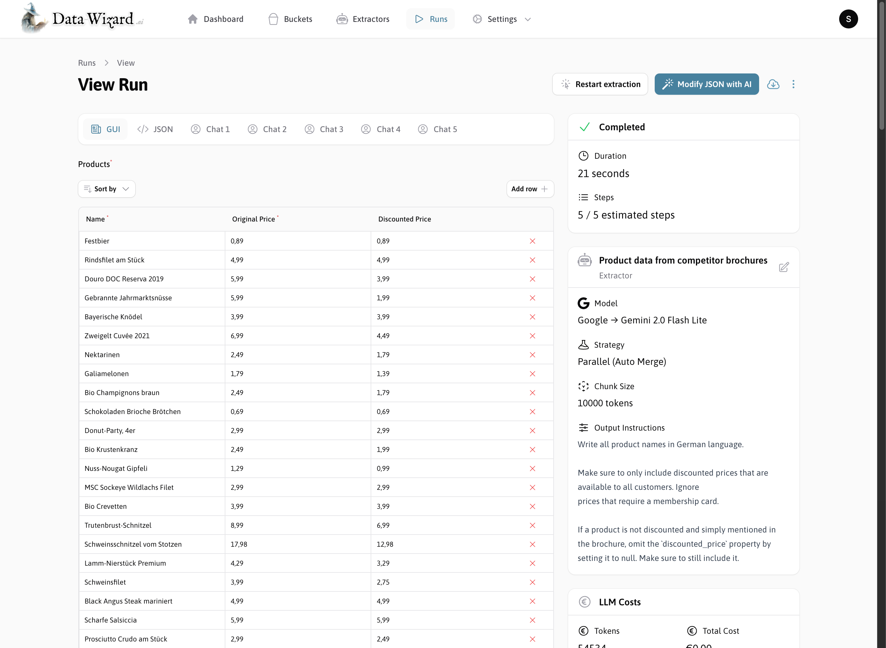
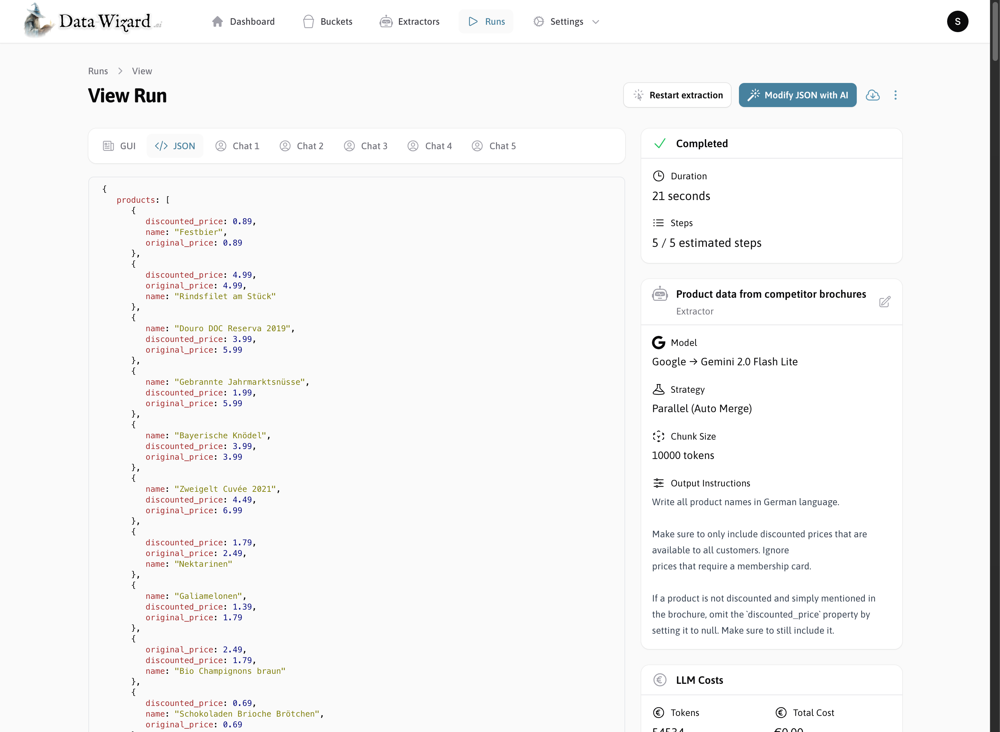

## Prepare your extraction task

Before we can extract some data, you'll need to tell the wizard what data you want to extract and how to extract it.

<Steps>
    <Step title="Create an extractor for your extraction task">
        You can just describe the shape of data you want to extract, and an AI will generate an initial draft for you.
        

          
    </Step>
    <Step title="Refine your JSON Schema and output instructions">
        Edit the generated schema to your liking and add other instructions for the AI to follow. Read more in the [Extractors](./extractors) section.

        

        <Card title="Extractors" icon="laptop-code" href="./extractors">
            Extractors are the core configuration objects in Data Wizard
        </Card>

          
    </Step>
    <Step title="Select the LLM to use">
        You can select from a large number of LLMs thanks to the [LLM Magic](https://github.com/Capevace/llm-magic) PHP package.
        You will need to add your API keys in the LLM settings before you can use them in an extractor. Find out more in the [LLM Provider Configuration](./configure-llm) section.

        

        <Card title="LLM Provider Configuration" icon="sliders" href="./configure-llm">
            Configure your Large Language Model (LLM) API provider in Data Wizard to connect to leading LLMs like OpenAI, Anthropic, Google AI, Mistral AI, and more.
        </Card>

          
    </Step>
    <Step title="Select the extraction strategy to use">
        There are multiple [built-in strategies](./strategies) to choose from, or you can create your own custom strategy.

        

        <Card title="Extraction Strategies" icon="code-branch" href="./strategies">
            Learn about the built-in and custom extraction strategies available in Data Wizard.
        </Card>

          
    </Step>
    <Step title="Run the extractor">
        After you have configured your extractor, you can run it to extract data from your documents.

        You can either use the built-in UI to do this, or you can integrate the feature into an existing application using the iFrame and HTTP API.

        <CardGroup cols={2}>
          <Card title="Run inside DataWizard" icon="hat-wizard" href="#run-inside-data-wizard">
            Via Data Wizard's backend UI
          </Card>
          <Card title="Run inside your own application" icon="server" href="#run-inside-your-own-application">
            Via the embedded iFrame UI
          </Card>
        </CardGroup>
    </Step>
</Steps>

## Run inside Data Wizard

<Steps>
    <Step title="Start an Extraction through a Bucket or an Extractor">
        All of the data that Data Wizard generates is viewable on the run page. This includes in-progress data as it's being generated, as well as the final extracted data.
        You can view the data both as raw JSON or in the GUI derived from the JSON schema.

        <Tabs>
            <Tab title="View Data in GUI">
                You can use the built-in UI to create and configure your extractor.

                
            </Tab>
            <Tab title="View Data as JSON">
                You can use the built-in UI to create and configure your extractor.
                
            </Tab>
        </Tabs>
    </Step>
    <Step title="View the extracted data in the GUI or as JSON">
        All of the data that Data Wizard generates is viewable on the run page. This includes in-progress data as it's being generated, as well as the final extracted data.
        You can view the data both as raw JSON or in the GUI derived from the JSON schema.

        <Tabs>
            <Tab title="View Data in GUI">
                You can use the built-in UI to create and configure your extractor.

                
            </Tab>
            <Tab title="View Data as JSON">
                You can use the built-in UI to create and configure your extractor.
                
            </Tab>
        </Tabs>
    </Step>

    <Step title="Inspect each extraction step">
        You can inspect each step of the extraction process to see how the AI is interpreting your instructions and what data it is returning.

        <Tabs>
            <Tab title="LLM Prompt and Responses">
                You can use the built-in UI to create and configure your extractor.

                
            </Tab>
            <Tab title="Supports Images and Tool Calls">
                You can use the built-in UI to create and configure your extractor.
                
            </Tab>
        </Tabs>
    </Step>
    <Step title="Download the Data as JSON, XML or CSV">
       asd
    </Step>
    <Step title="Restart the extraction with different parameters">
       asd
    </Step>

    <Step title="Modify the data using AI">
       asd
    </Step>

    <Step title="Analyze extraction costs">
       asd
    </Step>

</Steps>

## Run inside your own application

import More from '/snippets/more.mdx';

<More />