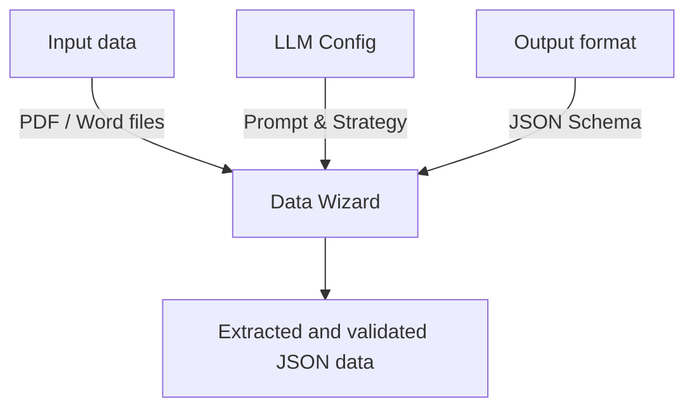
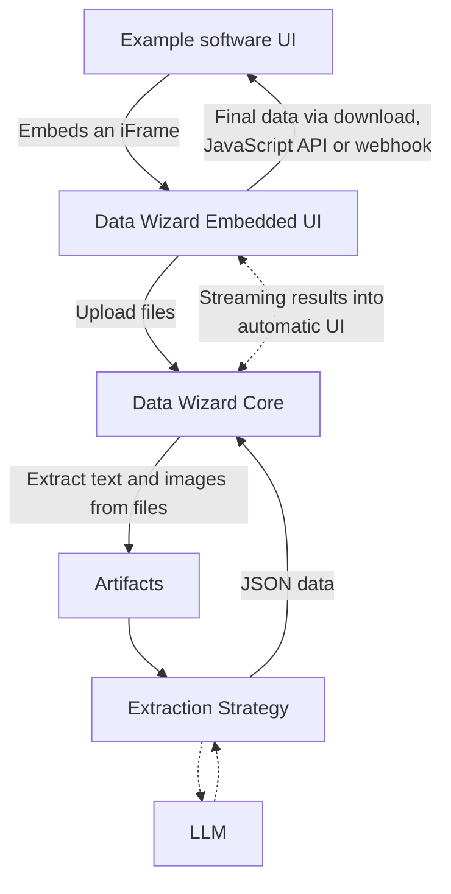

## What is Data Wizard?

**TLDR**:

- Data Wizard allows you to efficiently extract structured data from unstructured documents.
- It does so using Large Language Models (LLMs).
- It is built to work with basically any kind of document format or extraction use case.
- You can use Data Wizard as a standalone tool or integrate it into your applications.
- Data Wizard is open-source and free to use.

Data Wizard is an open-source tool designed to simplify and automate the extraction of structured data from unstructured documents using Large Language Models (LLMs). In today's digital landscape, valuable information is often locked away in PDFs, scanned forms, and other document formats that are difficult for computers to process. Data Wizard bridges this gap, transforming these documents into machine-readable JSON data, ready for integration into your systems and workflows.

Imagine you have a collection of PDF invoices and need to get the data into your accounting software. Manually typing out each invoice is time-consuming and error-prone. **Data Wizard solves this problem.**  Simply upload your invoices, configure a few settings, and Data Wizard will intelligently extract the key information like invoice numbers, dates, line items, and totals, delivering it to you in a structured JSON format.

But Data Wizard is more than just a simple PDF to JSON converter. It's a **flexible and powerful platform** built for developers and businesses seeking to harness the intelligence of LLMs for data extraction in a variety of contexts.

<Accordion title="How integration into your application works">

    
</Accordion>

## Why Use Data Wizard?

Data Wizard caters to a wide range of users and use cases. Here are just a few examples of how you can benefit from using Data Wizard:

<Card title="Convert PDFs to JSON" icon="file-pdf" iconSize={200}>
    You can convert data from a PDFs, Word files and scanned documents into a structured format like JSON, CSV, or XML.

     

    **Use Case:** You have a collection of unstructured documents, like PDFs or scanned papers, and need to extract data into a structured format like JSON, CSV, or XML for spreadsheets, databases, or simple record-keeping.

     

    **Solution:** Data Wizard's standalone user interface is perfect for this.  No coding required! Simply upload your files, select a pre-configured extractor or quickly create your own, and let Data Wizard do the heavy lifting. Download your extracted data in your desired format.

     

    <Tip>
    If you're not a techie, I'd recommend using [Data Wizard Cloud](https://data-wizard.ai) which hosts the application for you and requires no installation. If you're comfortable around Docker, you can try self-hosting with the [Docker Container](/quick-start).
    </Tip>
</Card>

<Card title="A company that wants to automate data entry" icon="robot" iconSize={200}>
    You can automate data entry from paper forms, invoices, receipts, and other documents, saving time and reducing errors.

     

    **Use Case:** You have a manual data entry process for paper forms, invoices, or receipts that is time-consuming and error-prone.

     

    **Solution:** Use Data Wizard to automatically extract data from scanned paper forms, invoices, or receipts into structured JSON. Streamline your workflows, reduce manual effort, and improve data accuracy by digitizing your paper-based processes.
</Card>

<Card title="SaaS company that wants to add smart import feature" icon="upload" iconSize={200}>
    You can offer a "smart import" feature in your SaaS application, allowing users to upload documents and automatically populate your application with the extracted data.

     

    **Use Case:** You are a SaaS provider for CRM, accounting, or inventory management software and want to offer your users a "smart import" feature.

     

    **Solution:** Embed Data Wizard directly into your SaaS application using iFrames or the REST/GraphQL API. Provide a seamless user experience by integrating data extraction directly into your workflow. Users can upload documents within your application, and Data Wizard will stream the extracted data back in real-time.
</Card>

<Card title="AI-powered data extraction as a core feature for SaaS" icon="gear" iconSize={200}>
    You can use Data Wizard as the core data extraction engine for your platform, supporting a wide range of document types and extraction tasks.

     

    **Use Case:** You are building a document processing or data analysis platform and need robust, adaptable data extraction capabilities.

     

    **Solution:** Use Data Wizard as the core data extraction engine for your platform using the REST/GraphQL API. Its modular architecture and LLM abstraction layer allow you to easily switch between different LLM providers, customize extraction strategies, and adapt to evolving LLM technologies.
</Card>

<Card title="Performing some competitor analysis & market research" icon="chart-line" iconSize={200}>
    You can gather product and pricing information from competitor brochures, websites, or advertisements for market research and competitive analysis.

     

    **Use Case:** You need to gather product and pricing information from competitor brochures, websites, or advertisements for market research and competitive analysis.

     

    **Solution:** Use Data Wizard to automatically extract product details, pricing, and other relevant information from publicly available documents. Gain valuable market insights quickly and efficiently, without manual data scraping and entry.
</Card>

## Ready to Get Started?

Choose the path that best suits your needs:

<CardGroup cols={2}>
    <Card title="Try it now with Data Wizard Cloud" icon="cloud" href="./cloud">
        The easiest way to use Data Wizard! A hosted, ready-to-use version that requires no installation.
    </Card>

    <Card title="Self-Host with Docker Container" icon="docker" href="./quick-start">
        For full control and integration capabilities. Install and run Data Wizard locally or on your own infrastructure using Docker. Ideal for developers.
    </Card>
</CardGroup>

## Check out some examples

We've prepared a few examples to show you how Data Wizard can be used in different scenarios. Each example includes a description of the use case, the types of documents that can be processed, example output data, and a template for an extractor.

<CardGroup cols={1}>
    <Card title="Invoice Data from Scans" icon="file-invoice" href="./examples/paper-invoice-to-structured-data" horizontal>
        Extract structured data from scanned invoices, including invoice numbers, dates, line items, and totals.
    </Card>
    <Card title="Products from Brochures" icon="newspaper" href="./examples/products-from-brochures" horizontal>
        Extract product names and prices from online brochures for competitor analysis or other use cases.
    </Card>
    <Card title="Customer Feedback to JSON" icon="clipboard-user" href="./examples/customer-feedback-to-data" horizontal>
        Transform handwritten or printed customer feedback forms into structured JSON for analysis and service improvement.
    </Card>
    <Card title="Tax Forms to JSON" icon="file" href="./examples/data-from-paper-tax-forms" horizontal>
        Extract structured data from tax forms, including personal information, income, deductions, and credits.
    </Card>
    <Card title="Real Estate from Exposes" icon="building" href="./examples/real-estate-from-exposes" horizontal>
        Extract structured data from real estate exposes, including property details, prices, and locations.
    </Card>
</CardGroup>

---

import More from '/snippets/more.mdx';

<More />