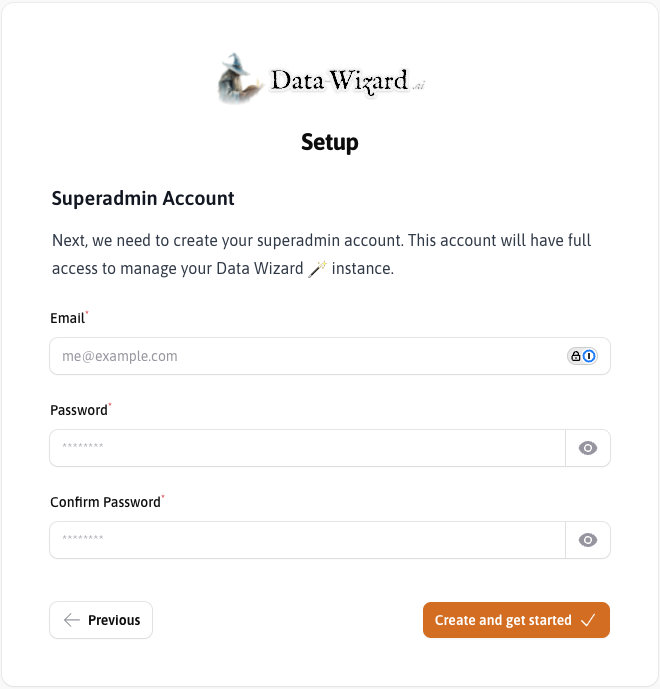
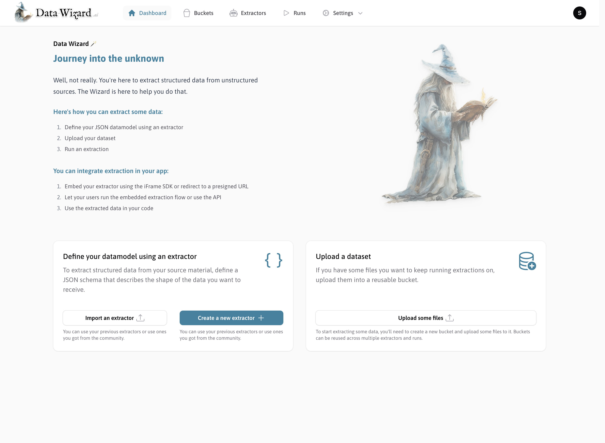

## Get Started using Docker

<Steps>
    <Step title="Generate a random `APP_KEY`">
        Before running the Docker container, you need to generate a random `APP_KEY` for your Data Wizard instance. This key is used for encryption and security purposes. Please note the `base64:` prefix.

        Run the following command to generate a random `APP_KEY`:
        ```bash
        openssl rand -base64 32
        ```

        **Make sure to use the `-base64` flag.**

        When using your generated key later, make sure to also prefix it with `base64:` like this:

        ```bash
        APP_KEY=base64:aaaaaaaaaaaaaaaaaaaaaaaaaaaaaaaaaaaaaaaaaaa=
        ```

        <br /><br />

    </Step>
    <Step title="Run the Docker Container">
        <Tabs>
            <Tab title="Docker Run">

                ```bash
                docker run \
                  --name data-wizard \
                  -p 9090:80 \
                  -p 4430:443 \
                  -p 4430:443/udp \
                  -v data_wizard_storage:/app/storage \
                  -v data_wizard_sqlite_data:/app/database \
                  -v data_wizard_caddy_data:/data \
                  -v data_wizard_caddy_config:/config \
                  -e APP_KEY=base64:[REPLACE_WITH_KEY] \
                  mateffy/data-wizard:latest
                ```

                | Option | Description |
                | --- | --- |
                | `-p 9090:80`, <br />`-p 4430:443`, <br />`-p 4430:443/udp` | Maps ports on your host machine to ports in the container for HTTP and HTTPS access. |
                | `-v ...:...` | Creates named volumes for persistent storage of application files, SQLite database, and Caddy server data and configuration. |
                | `-e APP_KEY=[APP_KEY]` | Sets the `APP_KEY` environment variable, essential for application security.  |
            </Tab>
            <Tab title="Docker Compose">
                ```yaml
                version: '3.8'

                services:
                  data-wizard:
                    name: data-wizard
                    image: mateffy/data-wizard:latest
                    ports:
                      - "9090:80"
                      - "4430:443"
                      - "4430:443/udp"
                    volumes:
                      - data_wizard_storage:/app/storage
                      - data_wizard_sqlite_data:/app/database
                      - data_wizard_caddy_data:/data
                      - data_wizard_caddy_config:/config
                    environment:
                      - APP_KEY=base64:[REPLACE_WITH_KEY]

                    volumes:
                      data_wizard_storage:
                      data_wizard_sqlite_data:
                      data_wizard_caddy_data:
                      data_wizard_caddy_config:
                ```

                Then run the following command in the same directory as your `docker-compose.yml` file:
                ```
                docker-compose up
                ```
            </Tab>
        </Tabs>

        <br /><br />
    </Step>
    <Step title="Access Data Wizard">
        Once the container is running, open your web browser and navigate to `https://localhost:4430`. You might see a
        warning about an invalid HTTPS certificate because it's a self-signed certificate for local development. You can
        safely ignore this warning for local testing.
    </Step>
</Steps>


## Initial Configuration

<Steps>
    <Step title="Welcome! 👋">
        The first time you access Data Wizard, you will be greeted with a setup screen. This confirms you have
        successfully installed Data Wizard.

        
    </Step>
    <Step title="Create Superadmin Account">
        Fill in the required details (Email, Password, Confirm Password) to create your superadmin account. This account
        will have full access to manage your Data Wizard instance.

        
    </Step>
    <Step title="Get Started">
        After creating the superadmin account, you are ready to start using Data Wizard! You can now log in with your
        newly created credentials and begin configuring extractors and running data extractions.

        
    </Step>
</Steps>

import More from '/snippets/more.mdx';

<More />
