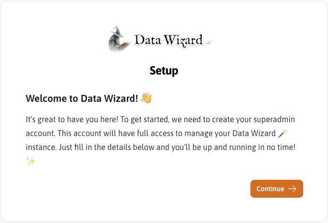

## Prerequisites

Before you begin, ensure you have the following prerequisites:

*   **Docker:** Docker is the recommended way to run Data Wizard. Make sure you have Docker installed and running on your system. You can download Docker from [Docker Desktop](https://www.docker.com/products/docker-desktop/).

## Installation

The easiest way to install Data Wizard is using the provided Docker image. Follow these steps:

### Docker Run

<Steps>
  <Step title="Pull the Docker Image">
    Open your terminal and pull the latest Data Wizard Docker image from Docker Hub.

    ```bash
    docker pull mateffy/data-wizard:latest
    ```
  </Step>
  <Step title="Run the Docker Container">
    Once the image is pulled, run the Docker container with the following command. **Important:** Replace `<REPLACE_WITH_APP_KEY>` with a randomly generated string. This `APP_KEY` is crucial for the security of your Data Wizard instance.

    <RequestExample>

    ```bash Getting Started with Docker
    docker run \
      --name data-wizard \
      -p 9090:80 \
      -p 4430:443 \
      -p 4430:443/udp \
      -v data_wizard_storage:/app/storage \
      -v data_wizard_sqlite_data:/app/database \
      -v data_wizard_caddy_data:/data \
      -v data_wizard_caddy_config:/config \
      -e APP_KEY=<REPLACE_WITH_APP_KEY> \
      mateffy/data-wizard:latest
    ```

    </RequestExample>

    ```bash
    docker run \
      --name data-wizard \
      -p 9090:80 \
      -p 4430:443 \
      -p 4430:443/udp \
      -v data_wizard_storage:/app/storage \
      -v data_wizard_sqlite_data:/app/database \
      -v data_wizard_caddy_data:/data \
      -v data_wizard_caddy_config:/config \
      -e APP_KEY=<REPLACE_WITH_APP_KEY> \
      mateffy/data-wizard:latest
    ```

    | Option | Description |
    | --- | --- |
    | `-p 9090:80`, <br/>`-p 4430:443`, <br/>`-p 4430:443/udp` | Maps ports on your host machine to ports in the container for HTTP and HTTPS access. |
    | `-v ...:...` | Creates named volumes for persistent storage of application files, SQLite database, and Caddy server data and configuration. |
    | `-e APP_KEY=<APP_KEY>` | Sets the `APP_KEY` environment variable, essential for application security. |

    **Generate a random `APP_KEY` using the following command:**
    ```bash
    openssl rand -base64 32
    ```
    </Step>
    <Step title="Access Data Wizard">
    Once the container is running, open your web browser and navigate to `https://localhost:4430`. You might see a warning about an invalid HTTPS certificate because it's a self-signed certificate for local development. You can safely ignore this warning for local testing.
    </Step>

</Steps>

### Docker Compose

If you prefer using Docker Compose, you can create a `docker-compose.yml` file with the following content:

```yaml
version: '3.8'

services:
  data-wizard:
    name: data-wizard
	image: mateffy/data-wizard:latest
	ports:
	  - "9090:80"
	  - "4430:443"
	  - "4430:443/udp"
	volumes:
	  - data_wizard_storage:/app/storage
	  - data_wizard_sqlite_data:/app/database
	  - data_wizard_caddy_data:/data
	  - data_wizard_caddy_config:/config
	environment:
	  - APP_KEY=<REPLACE_WITH_APP_KEY>

volumes:
  data_wizard_storage:
  data_wizard_sqlite_data:
  data_wizard_caddy_data:
  data_wizard_caddy_config:
```

Then run the following command in the same directory as your `docker-compose.yml` file:
```
docker-compose up
```

### Alternative Installation (Advanced Users)

While Docker is highly recommended, advanced users can also run Data Wizard as a standard Laravel application. This requires a PHP environment, a web server (like Nginx or Apache), and more manual configuration. Detailed instructions for this method are beyond the scope of this basic installation guide, but you can refer to standard [Laravel deployment documentation](https://laravel.com/docs/12.x/deployment) for guidance.

Data Wizard works with both `SQLite` and `PostgreSQL` databases. By default, the Docker image uses `SQLite` for simplicity, but you can configure it to use `PostgreSQL` by setting the appropriate environment variables.

## Initial Configuration

<Steps>
    <Step title="Welcome! 👋">
        The first time you access Data Wizard, you will be greeted with a setup screen. This confirms you have successfully installed Data Wizard.

        
    </Step>
    <Step title="Create Superadmin Account">
        Fill in the required details (Email, Password, Confirm Password) to create your superadmin account. This account will have full access to manage your Data Wizard instance.

        
    </Step>
    <Step title="Get Started">
        After creating the superadmin account, you are ready to start using Data Wizard! You can now log in with your newly created credentials and begin configuring extractors and running data extractions.

        
    </Step>
</Steps>

import More from '/snippets/more.mdx';

<More />