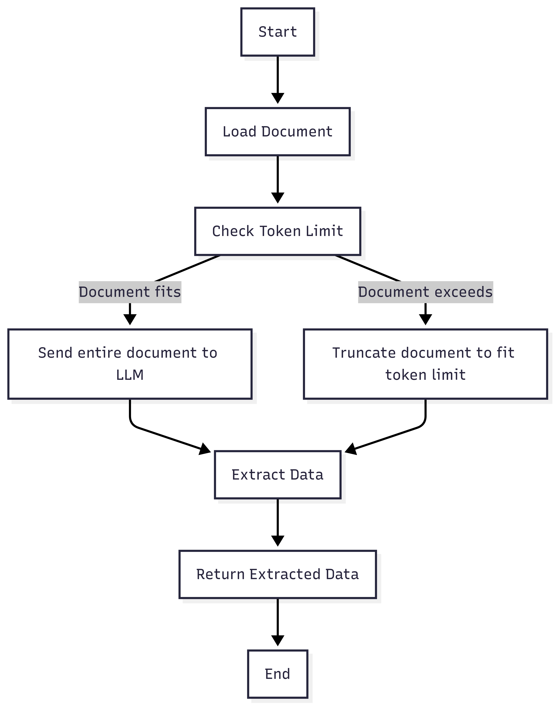
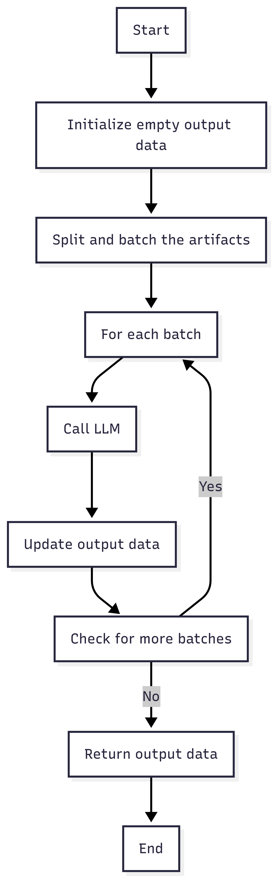
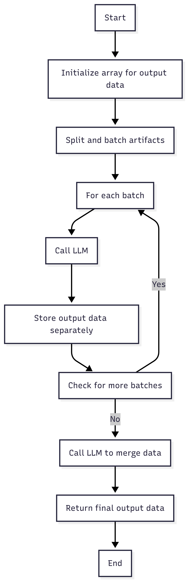
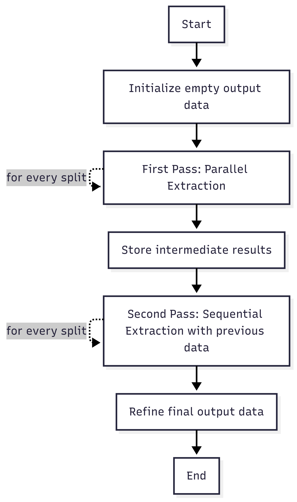

Strategies determine how Data Wizard processes the documents and interacts with the LLM. Data Wizard provides multiple built-in strategies, and you can also create custom strategies for specific needs.

## Built-in Strategies

- **Simple**: Sends as much of the document as possible within the token limit to the LLM in a single call. Suitable for small documents.
- **Sequential**: Splits the document into smaller parts (based on the chunk size), processes each part sequentially, and includes the results of the previous extraction in the prompt for the next part. Maintains contextual continuity.
- **Parallel**: Splits the document into independent parts and processes each part in isolation. Suitable for multiple independent data points. Good for extracting data that aren't interconnected across pages.
- **Auto-Merging**: Is the same as the sequential and parallel strategies, but additionally includes functionality that removes duplicate items by concatenating the items of the top-level properties and finally runs a final LLM call at the end to deduplicate the final results. This helps to make the models forget fewer entities if they have to make multiple calls.
- **Double-Pass**: Processes the document twice. On the first pass, it uses the parallel strategy, and on the second pass, it reviews and refines the first pass with the sequential strategy, taking both benefits for increased accuracy and efficiency. This one also supports auto-merging.

<AccordionGroup>
  <Accordion title="Simple">
    Sends as much of the document as possible within the token limit to the LLM in a single call.  Suitable for small documents.
    
  </Accordion>
    <Accordion title="Sequential">
        Splits the document into smaller parts (based on the chunk size), processes each part sequentially, and includes the results of the previous extraction in the prompt for the next part. Maintains contextual continuity.
        
    </Accordion>
    <Accordion title="Parallel">
        Splits the document into independent parts and processes each part in isolation. Suitable for multiple independent data points. Is good for extracting data that aren't interconnected across pages.
        
    </Accordion>
    <Accordion title="Sequential with Auto-Merging">
        Splits the document into smaller parts (based on the chunk size), processes each part sequentially, and includes the results of the previous extraction in the prompt for the next part. Maintains contextual continuity. This one also supports auto merging.
    </Accordion>
    <Accordion title="Parallel with Auto-Merging">
        Splits the document into independent parts and processes each part in isolation. Suitable for multiple independent data points. Is good for extracting data that aren't interconnected across pages. This one also supports auto merging.
    </Accordion>
    <Accordion title="Double-Pass">
        Processes the document twice.  On the first pass, it uses the parallel strategy, and on the second pass, it reviews
        and refines the first pass with the sequential strategy, taking both benefits for increased accuracy and efficiency. This one also supports auto merging.
        
    </Accordion>
</AccordionGroup>

## Strategy Options

Each strategy can be configured with a set of options:

*   **Chunk Size:** The maximum number of tokens to include in each LLM call.
*   **Include Text:** Whether to include the raw text content of the document in the prompt.
*   **Include Embedded Images:** Whether to include embedded images from the document in the prompt.
*   **Mark Embedded Images:** Whether to mark embedded images in the document with identifiers.
*   **Include Page Images:** Whether to include screenshots of the document pages in the prompt.
*   **Mark Page Images:** Whether to mark page images with identifiers.

## Custom Strategies

You can create custom extraction strategies to tailor Data Wizard to specific document types or complex extraction tasks. Implement these steps:
1. Create a class that extends the `\Mateffy\Magic\Extraction\Strategies\Extractor` or implements the `Mateffy\Magic\Extraction\Strategies\Strategy` interface
2. Implement your strategy in the `run()` method, which takes the artifacts as an array
4. Call `Magic::registerStrategy('my-custom-strategy', MyCustomStrategy::class)` in your `boot()` method in the service provider

Now your custom strategy is usable in the Data Wizard settings UI.

import More from '/snippets/more.mdx';

<More />